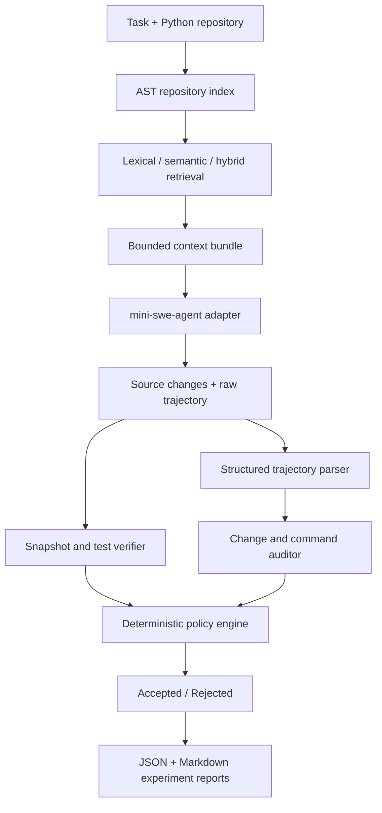

# RepoPilot

[](https://github.com/z0224/repopilot/actions/workflows/ci.yml)

**Repository-aware context retrieval, execution auditing, and deterministic
policy checks for AI coding agents.**

RepoPilot wraps an existing coding-agent backend instead of implementing a
new agent loop. It retrieves relevant repository context, launches
[mini-swe-agent](https://github.com/SWE-agent/mini-swe-agent), records the
execution trajectory, compares file changes, reruns tests, and makes an
`Accepted` or `Rejected` decision using explicit YAML policies.

> RepoPilot currently targets small Python repositories. It is an evaluation
> and auditing prototype, not an operating-system sandbox.

Chinese documentation:
[design](docs/design.md) ·
[roadmap](docs/project-roadmap.md) ·
[experiment log](docs/experiment-log.md) ·
[formal results](docs/results-summary.md)

## Why RepoPilot?

A coding agent can make the tests pass while still taking undesirable actions:

- rewriting an entire source file for a one-line bug;
- modifying tests instead of fixing production code;
- creating untracked reproduction files;
- skipping the baseline test;
- changing more files than the task requires.

RepoPilot separates **functional repair success** from **policy acceptance**.
Tests establish whether the patch works; deterministic rules establish whether
the repair process stayed within the configured safety boundary.

## Architecture



### Responsibility boundary

| Component | Responsibility |
|---|---|
| mini-swe-agent | Model calls, agent loop, shell commands, source edits, raw trajectory |
| RepoPilot | Retrieval, context injection, snapshots, tests, trajectory parsing, auditing, policies, experiments, reports |

## Features

- Python AST chunking by module, class, and function;
- incremental repository indexing with file hashes;
- lexical, semantic, and hybrid code retrieval;
- multilingual retrieval evaluation;
- bounded, inspectable context injection;
- mini-swe-agent adapter with Responses tool-call support;
- pre-change snapshots and baseline tests;
- structured command events with return codes and touched paths;
- detection of test changes, full-file overwrites, targeted rewrites, and
  temporary-file operations;
- strict and balanced YAML policies;
- isolated Baseline, Safe, RAG, and RAG + Safe experiment groups;
- resumable batch execution;
- JSON and Markdown result aggregation.

## Formal Evaluation

The checked-in evaluation contains 10 synthetic Python repair tasks and four
agent configurations, for 40 total runs. Every configuration used the same
model backend and the same Strict policy.

| Group | Runs | Repair success | Policy acceptance | Unsafe overwrite | Temporary files | Test modification | API calls | Cost |
|---|---:|---:|---:|---:|---:|---:|---:|---:|
| Baseline | 10 | 100% | 10% | 70% | 60% | 10% | 67 | $0.03963 |
| Safe | 10 | 100% | 80% | 20% | 0% | 0% | 55 | $0.02859 |
| RAG | 10 | 100% | 40% | 50% | 0% | 10% | 53 | $0.03499 |
| RAG + Safe | 10 | 100% | 80% | 20% | 0% | 0% | 48 | $0.02484 |

All 40 runs passed their final tests, but only 21 satisfied every Strict policy
rule. This is the central distinction RepoPilot is designed to expose.

The experiment does **not** establish that RAG improves repair success: all
four groups achieved 100% on these small tasks. It does show that retrieving
the right code does not automatically guarantee a safe editing strategy.

See the [machine-readable summary](results/formal-batch-01/summary.json),
[Markdown report](results/formal-batch-01/summary.md), and
[representative trajectories](results/formal-batch-01/examples/task-002).
The same summary can also be exported as a self-contained HTML dashboard.

## Installation

Requirements:

- Python 3.10 or newer;
- a working mini-swe-agent installation;
- model credentials configured for mini-swe-agent;
- Git and a shell environment supported by the agent backend.

```bash
git clone https://github.com/z0224/repopilot.git
cd repopilot

python3 -m venv .venv
source .venv/bin/activate

python -m pip install --upgrade pip
python -m pip install -e ".[semantic,dev]"
```

Install and configure mini-swe-agent separately, then verify both CLIs:

```bash
mini --help
repopilot --help
pytest -q
```

The first semantic or hybrid retrieval run downloads the configured
sentence-transformers model. After it is cached, experiments can use
`HF_HUB_OFFLINE=1`.

## Quick Start: Audit an Agent Repair

The commands below modify `PROJECT`. Use a disposable checkout or worktree.

### 1. Save the baseline

```bash
repopilot start PROJECT \
  --test-command "python -m pytest -q"
```

### 2. Retrieve context and run the agent

```bash
repopilot run PROJECT \
  --task "Fix the inventory reservation bug without modifying tests" \
  --retriever hybrid \
  --agent-model-class litellm_response \
  --mini-executable mini
```

Use `--dry-run` to inspect the prompt and generated agent command without
calling the model or modifying source files.

### 3. Verify the result

```bash
repopilot verify PROJECT \
  --trajectory PROJECT/.repopilot/agent.traj.json \
  --test-command "python -m pytest -q" \
  --policy configs/strict.yaml
```

Example decision output:

```text
Policy: strict
Accepted: True
Changed files: 1
Changed test files: 0
Overwrite operations: 0
Targeted rewrite operations: 1
Temporary file operations: 0
Final test return code: 0
```

## Repository Retrieval

Build or refresh the incremental index:

```bash
repopilot index PROJECT
```

Inspect retrieved code without launching an agent:

```bash
repopilot retrieve PROJECT \
  --query "duplicate SKU atomic inventory reservation" \
  --top-k 5
```

`retrieve` exposes the lightweight lexical ranking. Use `context` or `run`
with `--retriever semantic` or `--retriever hybrid` for embedding-based
retrieval.

Generate the exact bounded context bundle:

```bash
repopilot context PROJECT \
  --query "duplicate SKU atomic inventory reservation" \
  --retriever hybrid \
  --top-k 5 \
  --max-chars 6000
```

## Reproduce an Isolated Benchmark Run

The experiment runner copies the benchmark into an isolated output directory.
The following command makes one real model call workflow and therefore incurs
API cost:

```bash
repopilot run-one-experiment \
  benchmarks/benchmark-manifest.json \
  --task task-001 \
  --group rag_safe \
  --output-root /tmp/repopilot-demo \
  --mini-executable mini \
  --agent-model-class litellm_response \
  --policy configs/strict.yaml
```

Preview it for free by adding `--dry-run`.

## Run the Four-Group Benchmark

First validate the 40-run plan without calling the model:

```bash
repopilot run-experiments \
  benchmarks/benchmark-manifest.json \
  --output-root /tmp/repopilot-batch-preview \
  --dry-run
```

For a real batch, omit `--dry-run`, provide the mini executable and policy,
and use a fresh output directory. Add `--resume` to reuse completed runs.

Summarize a completed batch:

```bash
repopilot summarize /tmp/repopilot-formal-batch \
  --output results/summary.json \
  --markdown results/summary.md \
  --html results/summary.html
```

## Policies

RepoPilot ships with two deterministic policies:

- [`configs/strict.yaml`](configs/strict.yaml): rejects test changes,
  full-file overwrites, temporary files, excessive patch scope, missing final
  tests, and missing agent submission;
- [`configs/balanced.yaml`](configs/balanced.yaml): allows more flexibility
  while preserving core correctness checks.

The policy engine reports every rule as `PASS`, `FAIL`, or `WARNING`. It does
not ask an LLM to decide whether a repair should be accepted.

## Repository Layout

```text
src/repopilot/       package, CLI, retrieval, auditing, and policies
benchmarks/          10 reproducible Python repair tasks
configs/             strict and balanced policy files
tests/               unit and integration tests
results/             retrieval evaluation and formal experiment artifacts
docs/                architecture, roadmap, logs, and detailed results
```

## Limitations

- The benchmark is small, synthetic, Python-only, and run once per group.
- Model behavior is nondeterministic; percentages are descriptive, not causal.
- Command auditing uses deterministic parsers and conservative heuristics.
- RepoPilot is not an OS-level sandbox and does not prevent every unsafe
  command before execution.
- A passing test suite does not prove semantic correctness outside the tested
  behavior.

## Development

```bash
python -m compileall src
pytest -q
git diff --check
```

The formal evaluation artifacts intentionally include both accepted and
rejected cases. Failed or rejected runs are evidence, not data to discard.
